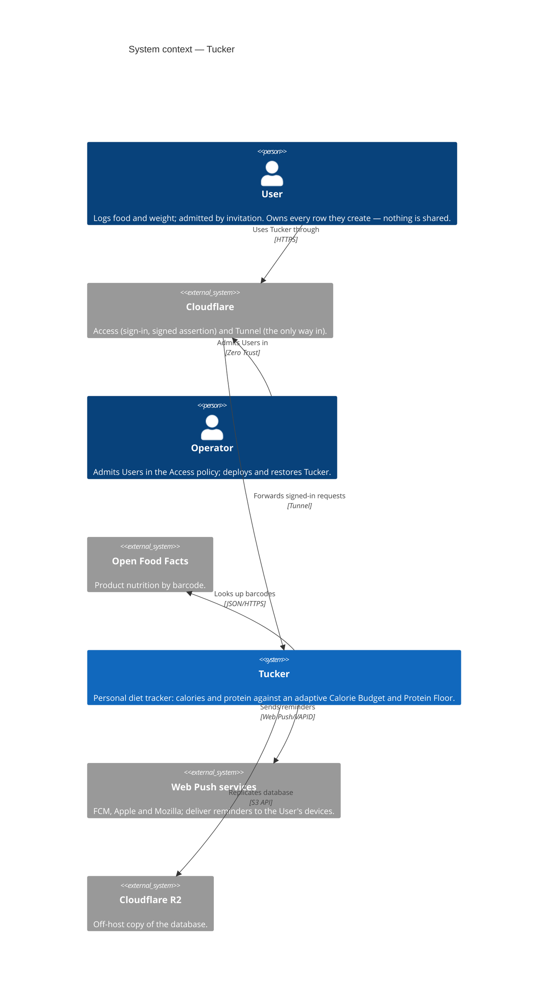
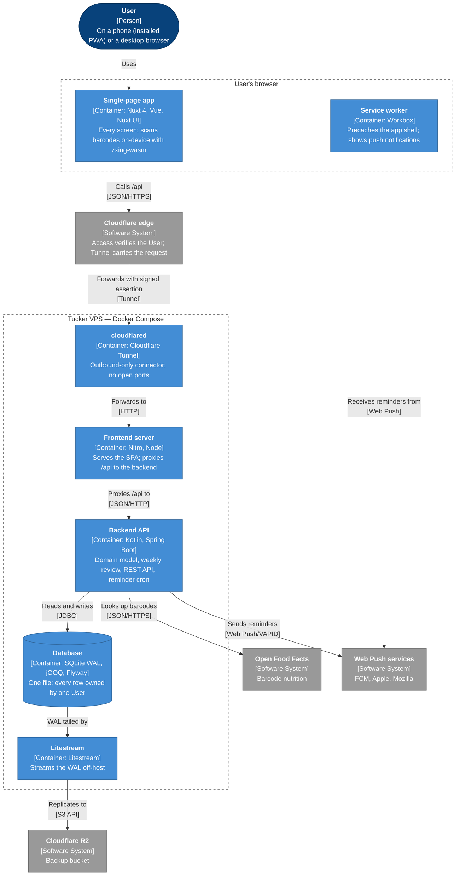
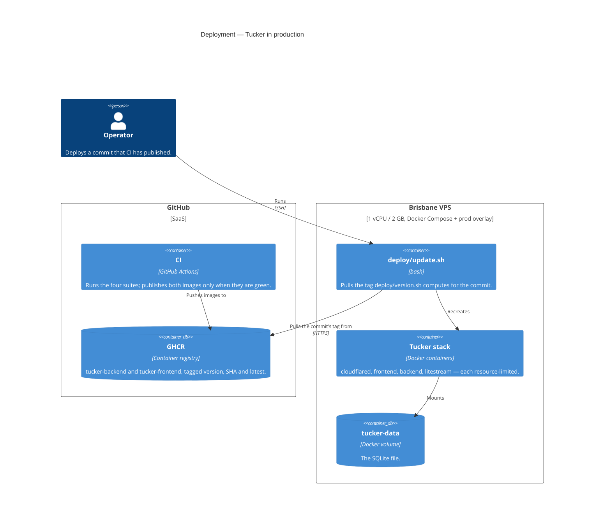
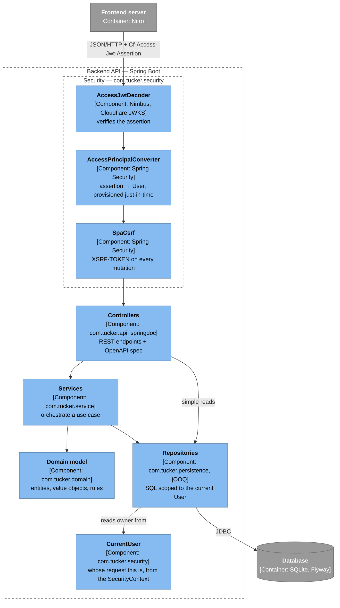
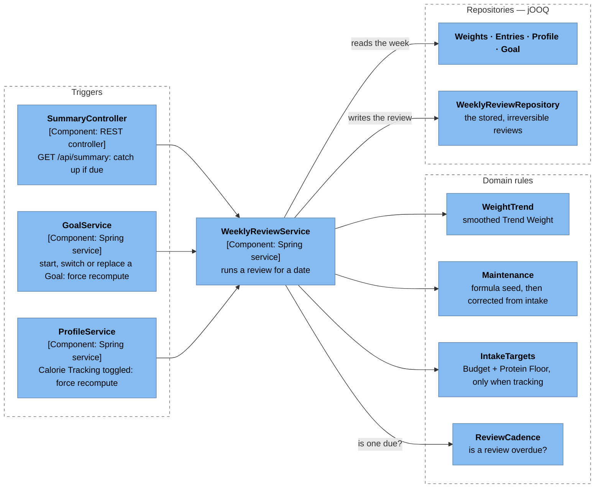
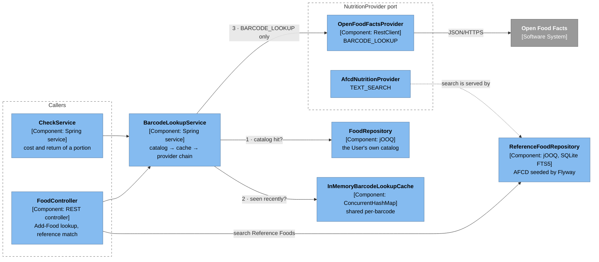
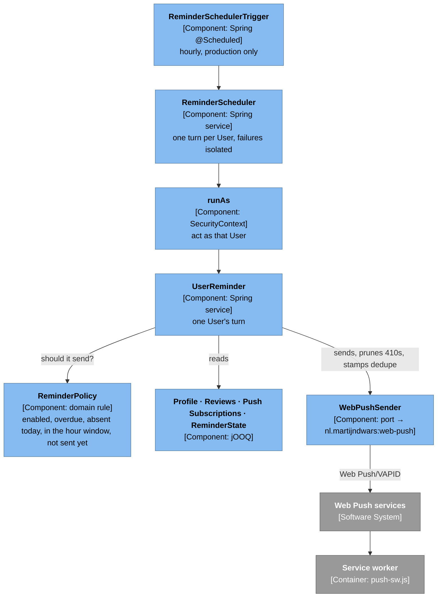
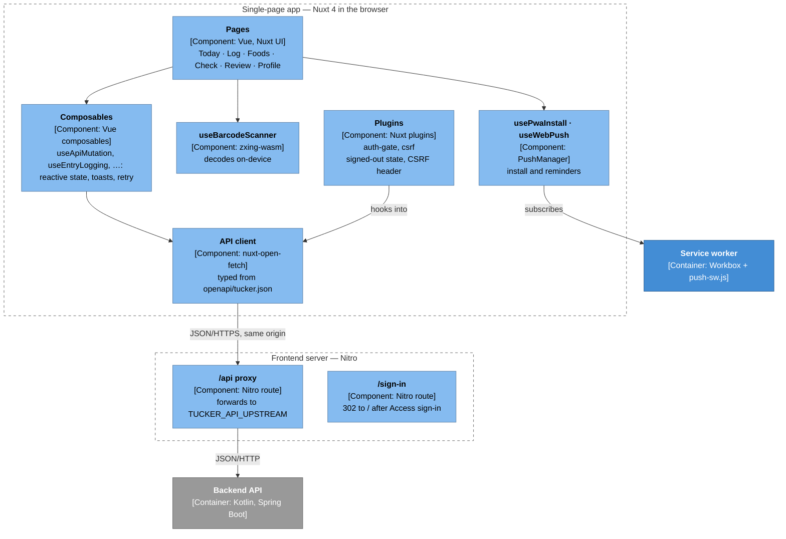
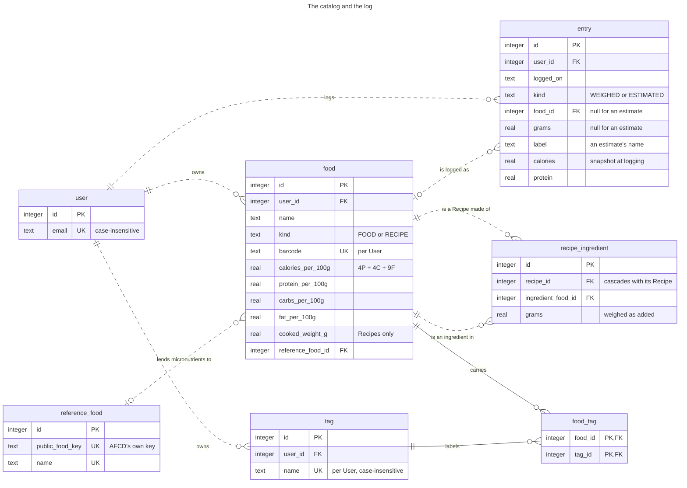
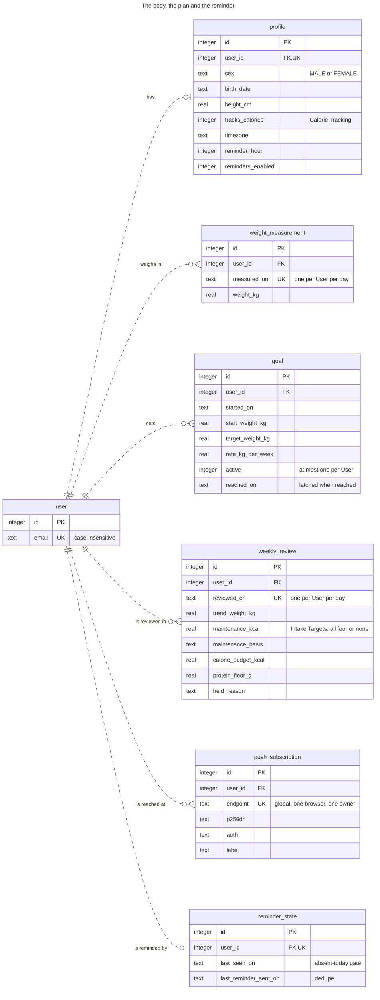

# Architecture

Tucker's architecture as [C4](https://c4model.com) diagrams, drawn in Mermaid so
GitHub renders them in place. One diagram per level, zoom in going down: the
system in its world (Level 1), the deployable pieces inside it (Level 2), and the
components inside the pieces that carry the interesting behaviour (Level 3).

Level 1 and the deployment view use Mermaid's native
[C4 syntax](https://mermaid.js.org/syntax/c4.html). Levels 2 and 3 use a
C4-styled `flowchart`, because Mermaid's C4 renderer has no automatic layout:
it places elements in rows by statement order, and with two boundaries and
twelve elements its relationships cut straight through the shapes. The notation
changes; the abstraction level does not. The colours follow C4's convention:

| Colour | Meaning |
| --- | --- |
| Dark blue | A person, or Tucker itself |
| Light blue | A Tucker container or component |
| Grey | Something outside Tucker — or, at Level 3, outside the container being zoomed into |
| Dashed box | A boundary: where things run, or which container they belong to |

The domain words used here — Entry, Food, Weekly Review, Calorie Budget — are
defined in [`CONTEXT.md`](../CONTEXT.md); the reasons behind the shapes are in
[`docs/adr/`](adr/).

## Level 1 — System context

Who uses Tucker and what it depends on. Tucker holds no credentials of its own:
Cloudflare Access is the only sign-in, and its policy is the invitation list
([ADR 0020](adr/0020-identity-comes-from-cloudflare-access.md)).

## Level 2 — Containers

The deployable and runtime pieces. The browser only ever talks to one origin: the
frontend's nitro server serves the SPA and proxies `/api` to the backend, so the
backend is never exposed ([ADR 0015](adr/0015-production-deployment-topology.md)).

### Deployment

How the containers reach the box. Nothing builds on the VPS: CI publishes both
images to GHCR only for a commit whose suites were green, and
`deploy/update.sh` pulls the tag `deploy/version.sh` computes for that commit
(see [`deploy/README.md`](../deploy/README.md)).

## Level 3 — Components

One diagram per area worth zooming into. Each shows the components of one
container that take part in one flow, not the whole container.

### Backend: the request path

Every `/api` request passes the same layers. The backend verifies the Access
assertion itself rather than trusting the edge, resolves it to a User
(provisioning one on first sight), and repositories scope every query to that
User from the security context — no repository signature carries an owner
([ADR 0021](adr/0021-every-row-is-owned-by-one-user.md)). Behaviour lives in the
domain model, not in the services
([ADR 0001](adr/0001-domain-driven-design.md)).

### Backend: the adaptive Weekly Review

How the Calorie Budget and Protein Floor come to be. The engine is lazy — a
review is run when something reads the summary and one is due — plus a forced
recompute whenever a Goal or the Calorie Tracking setting changes. There is no
LLM anywhere in it: the math is deterministic.

### Backend: nutrition lookup

A barcode resolves to one of four outcomes: a Food already in the User's
catalog, a Food Candidate from a provider, a miss, or an Inconclusive Lookup when
the provider cannot be reached. Providers sit behind a capability-based port, so
the barcode chain and the AFCD text search share one seam without sharing a code
path ([ADR 0006](adr/0006-provider-agnostic-nutrition-lookup.md),
[ADR 0027](adr/0027-micronutrients-are-borrowed-bounded-and-never-a-target.md)).

### Backend: the Weekly-Review Reminder

Tucker's only scheduled job, and it only *sends* — it computes no review. Each
hour it gives every User their own turn under their own identity, so the same
scoped repositories a request uses serve the cron too
([ADR 0010](adr/0010-minimal-scheduler-for-the-weekly-reminder.md)).

### Frontend: the SPA and its server

The SPA holds no business rules — it presents fields the backend derived
([ADR 0002](adr/0002-business-logic-belongs-in-the-backend.md)). Its API client
is generated from the backend's committed OpenAPI spec, and every request goes
back to the origin it was served from.

## Data — the database schema

The SQLite schema as of the latest Flyway migration
(`backend/src/main/resources/db/migration/`), in two halves around the `user`
table: what a User eats, and what their body and plan are doing. Every table but
the reference data carries a `NOT NULL user_id`, and the uniqueness a User would
expect is per-User — one weigh-in per day, one Weekly Review per day, one active
Goal, a barcode once per catalog
([ADR 0021](adr/0021-every-row-is-owned-by-one-user.md)). `created_at` /
`updated_at` are omitted from every entity; dates are ISO-8601 `text`.

Relationship lines follow Mermaid's
[ER notation](https://mermaid.js.org/syntax/entityRelationshipDiagram.html): a
solid line is identifying (the foreign key is part of the child's primary key),
a dashed one is not.

### The catalog and the log

A Recipe is a `food` row of `kind = 'RECIPE'` whose ingredients are other Foods.
An Entry names a Food when it was weighed and names none when it is an estimate,
which the table's own `CHECK` enforces. `recipe_ingredient` carries no `user_id`:
it is owned through its Recipe.

`reference_food` also carries 19 micronutrient columns per 100 g (`fibre_g` to
`vitamin_e_mg`), left out of the box for size.

### The body, the plan and the reminder

### Reference data

Four tables belong to no User. They are seeded by migrations or bootstrapped by
the app, and the same for everybody.

| Table | Holds | Filled by |
| --- | --- | --- |
| `reference_food` | AFCD Release 3: 1,588 generic foods with micronutrients per 100 g, searched through the FTS5 index `reference_food_fts` | Flyway (V16, V17) |
| `reference_food_synonym` | Query rewrites for Reference Food search (`term` → `replacement`) | Flyway (V17) |
| `nutrient_reference_value` | NHMRC Nutrient Reference Values by nutrient, sex and the age a band opens at | Flyway (V18) |
| `app_config` | Installation-wide key/value settings, such as the VAPID key pair | The app, on first boot |

## Keeping this current

Update these diagrams in the same change whenever a module boundary, an external
integration, a data flow or the schema changes, and check the result in GitHub's
preview rather than only the source. Mermaid's C4 renderer places elements by
statement order and wraps its rows at the viewer's `screen.availWidth`, so a new
element can reshuffle a diagram that still parses. It also means a headless
renderer, whose screen is 800px wide, draws two elements per row whatever
`UpdateLayoutConfig` says.
